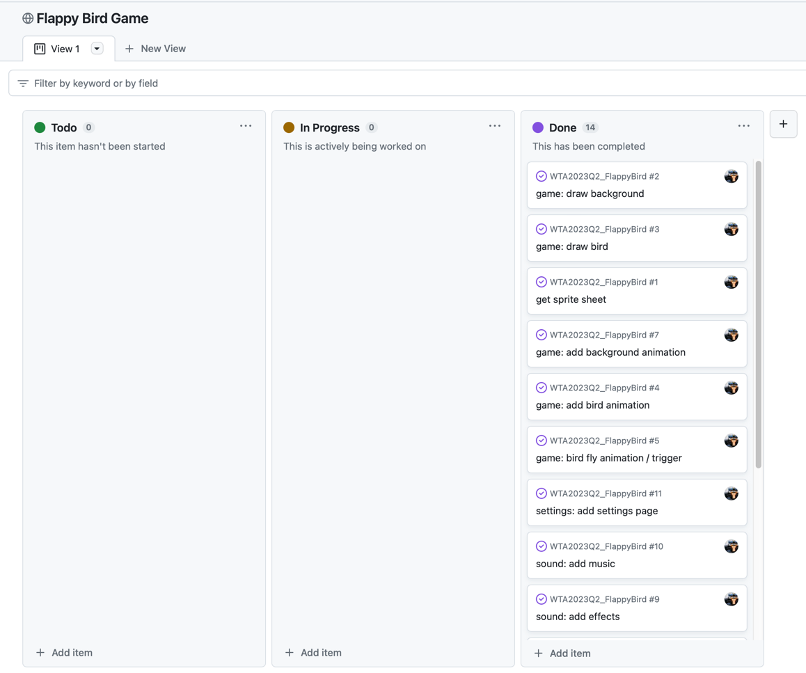

# Flappy Bird

## Content

- [Overview](#Overview)
- [Installation](#Installation)
- [Known Bugs](#Known-Bugs)
- [Project plan](#Project-Plan)
- [Keybindings](#Keybindings)
- [Game Options](#Game-Options)
- [Credits](#Credits)

## Overview

The game is a clone of the famous Flappy Bird game.
The goal is to fly through the pipes without touching them.
The game is over when the bird touches the ground or a pipe.

## Installation

Copy the repository to your local machine and open the
`index.html` file in your browser.
Alternative: [Play the game online](https://flappybird.fambreit.com/)

## Known Bugs

- [In hard mode enabled, the background may flicker when the game speed increases](https://github.com/flnbrt/WTA2023Q2_FlappyBird/issues/17)

## Project Plan

The project plan can be found [here](https://github.com/users/flnbrt/projects/1).

## Keybindings

The game can be played with mouse or with the keyboard.
The following keybindings are available:

- `ESC`: Exit/Reset the game
- `M`: Mute/Unmute the music
- `S`: Mute/Unmute the sound
- `Enter`: Quick-Start game (only in main menu)
- `Space`: Jump
- `V`: change background
- `B`: change bird color
- `N`: change pipe color
- `G`: change difficulty

## Game-Options

The game gets shipped with various game options.

### Content

- [Visualisation](#Visualisation)
  - [Background](#Background)
  - [Bird](#Bird)
  - [Pipes](#Pipes)
- [Music](#Music)
- [Sound](#Sound)
- [Difficulty](#Difficulty)

### Visualisation

#### Background

The background can be changed to a darker color scheme.

#### Bird

The bird color can beset to three different colors.

#### Pipes

The pipes can be altered between two color schemes.

### Music

The music is initially turned off.
It can be muted or unmuted and is played in a loop.

### Sound

The sound is initially turned on. It can be muted or unmuted
and is played when the player clicks and the bird collides
with a pipe or the ground.

### Difficulty

The difficulty can be set to two different levels (normal or hard).

In game mode `normal`, the game speed and pipe gap are set to a fixed value.
In game mode `hard`, the game speed increases and the pipe gap decreases after every gained score.

## Credits

This game is based on the help of the following contributions:
- [FHDW](https://github.com/FHDW)
- [Flappy Bird Javascript](https://codepen.io/ju-az/pen/eYJQwLx/)
- [Flappy Bird SpriteSheet](https://www.spriters-resource.com/mobile/flappybird/sheet/59894/)
- [Flappy Bird Sound Effects](https://www.sounds-resource.com/mobile/flappybird/sound/5309/)
- [Best CSS Button Generator](https://www.bestcssbuttongenerator.com/)